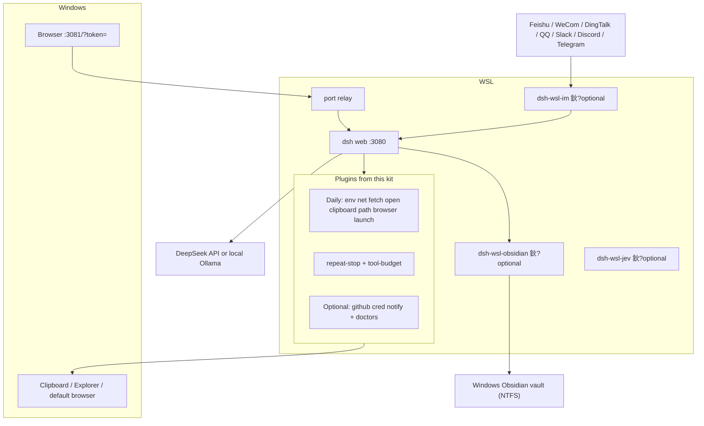

# dsh-wsl-kit

**One line:** DeepSeek Harness agent in WSL, chat in a Windows browser 鈥?install this kit when paths, proxy, clipboard, and 鈥渙pen that file鈥?must cross the OS boundary.

This is a **meta-repo** (docs + install script + [`cordis.patch.yml`](./cordis.patch.yml)). It does not ship plugin runtimes. Each plugin repo ships English `README.md` and Chinese `README.zh.md`.

[涓枃璇存槑 鈫?README.zh.md](./README.zh.md)

---

## How the pieces fit

The kit is not a runtime. `install.sh` clones plugins into the dsh `web` profile. Chat stays on Windows; the agent and tools stay in WSL. Optional [dsh-wsl-im](https://github.com/173787247/dsh-wsl-im), [dsh-wsl-obsidian](https://github.com/173787247/dsh-wsl-obsidian), and [dsh-wsl-jev](https://github.com/173787247/dsh-wsl-jev) are **not** in `install.sh`.



| Boundary | Who owns it |
|----------|-------------|
| Windows UI | Browser on `:3081` with a one-shot `?token=` (bare `:3081` is 401; `:3080` is WSL-only) |
| Agent | `dsh web` inside WSL, tools via plugin `ctx` |
| Cross-OS | Daily plugins (`path`, `open`, `clipboard`, `browser`, `launch`, `net`, `fetch`) |
| IM | `dsh-wsl-im` outbound WS/Stream/Gateway 鈫?`ctx.agents`. One workspace per IM, one session per chat |
| Obsidian | `dsh-wsl-obsidian`: WSL agent 鈫?Windows NTFS vault + `obsidian://`. Not in `install.sh` |
| Jev | `dsh-wsl-jev`: System One decisions (`jev_ask` / `check` / `rank`) via OpenRouter or TypeSafe. Not in `install.sh` |

## Plugin versions

Sibling checkout versions on **2026-09-18**. Floors enforced by [`scripts/check-plugin-versions.sh`](./scripts/check-plugin-versions.sh) are the minimum, not this snapshot.

Local dsh line the same day: **`0.1.6-alpha.1`** (`alpha` tag). npm `latest` noted earlier in this file was still **`0.1.5-rc.1`**. Scripts still assume dsh **鈮?.1.2**.

### Daily

| Plugin | Version | Set |
|--------|---------|-----|
| [dsh-wsl-env](https://github.com/173787247/dsh-wsl-env) | 0.3.0 | daily |
| [dsh-wsl-net](https://github.com/173787247/dsh-wsl-net) | 0.5.2 | daily |
| [dsh-wsl-fetch](https://github.com/173787247/dsh-wsl-fetch) | 0.1.2 | daily |
| [dsh-wsl-open](https://github.com/173787247/dsh-wsl-open) | 0.2.0 | daily |
| [dsh-repeat-stop](https://github.com/173787247/dsh-repeat-stop) | 0.1.2 | daily |
| [dsh-tool-budget](https://github.com/173787247/dsh-tool-budget) | 0.1.2 | daily |
| [dsh-wsl-clipboard](https://github.com/173787247/dsh-wsl-clipboard) | 0.1.0 | daily |
| [dsh-wsl-path](https://github.com/173787247/dsh-wsl-path) | 0.2.0 | daily |
| [dsh-wsl-browser](https://github.com/173787247/dsh-wsl-browser) | 0.1.0 | daily |
| [dsh-wsl-launch](https://github.com/173787247/dsh-wsl-launch) | 0.1.0 | daily |

### GitHub add-on and optional

| Plugin | Version | Set |
|--------|---------|-----|
| [dsh-wsl-github](https://github.com/173787247/dsh-wsl-github) | 0.2.0 | github |
| [dsh-wsl-cred](https://github.com/173787247/dsh-wsl-cred) | 0.2.0 | github |
| [dsh-wsl-notify](https://github.com/173787247/dsh-wsl-notify) | 0.1.0 | github |
| [dsh-wsl-im](https://github.com/173787247/dsh-wsl-im) | 0.3.2 | not in `install.sh` |
| [dsh-wsl-obscura](https://github.com/173787247/dsh-wsl-obscura) | 0.1.0 | not in Daily |
| [dsh-wsl-obsidian](https://github.com/173787247/dsh-wsl-obsidian) | 0.1.0 | not in `install.sh` (optional) |
| [dsh-wsl-jev](https://github.com/173787247/dsh-wsl-jev) | 0.1.0 | not in `install.sh` (optional) |
| [dsh-wsl-ollama](https://github.com/173787247/dsh-wsl-ollama) | 0.1.0 | not in `install.sh` (optional) |
| [dsh-wsl-media](https://github.com/173787247/dsh-wsl-media) | 0.1.0 | not in `install.sh` (optional) |
| [dsh-wsl-search](https://github.com/173787247/dsh-wsl-search) | 0.1.0 | not in `install.sh` (optional) |
| [dsh-wsl-vecmem](https://github.com/173787247/dsh-wsl-vecmem) | 0.1.0 | not in `install.sh` (optional) |
| [dsh-wsl-k8s](https://github.com/173787247/dsh-wsl-k8s) | 0.1.0 | not in `install.sh` (optional) |
| [dsh-wsl-secret](https://github.com/173787247/dsh-wsl-secret) | 0.1.0 | not in `install.sh` (optional) |

### Full-set extras

| Plugin | Version | Plugin | Version |
|--------|---------|--------|---------|
| [gpu](https://github.com/173787247/dsh-wsl-gpu) | 0.2.2 | [port](https://github.com/173787247/dsh-wsl-port) | 0.2.2 |
| [distro](https://github.com/173787247/dsh-wsl-distro) | 0.2.0 | [workspace](https://github.com/173787247/dsh-wsl-workspace) | 0.2.0 |
| [picker](https://github.com/173787247/dsh-wsl-picker) | 0.1.0 | [tray](https://github.com/173787247/dsh-wsl-tray) | 0.2.4 |
| [expose](https://github.com/173787247/dsh-wsl-expose) | 0.2.2 | [hostsvc](https://github.com/173787247/dsh-wsl-hostsvc) | 0.4.3 |
| [clock](https://github.com/173787247/dsh-wsl-clock) | 0.2.0 | [dns](https://github.com/173787247/dsh-wsl-dns) | 0.2.0 |
| [mnt](https://github.com/173787247/dsh-wsl-mnt) | 0.2.0 | [editor](https://github.com/173787247/dsh-wsl-editor) | 0.1.0 |
| [shot](https://github.com/173787247/dsh-wsl-shot) | 0.1.0 | [docker](https://github.com/173787247/dsh-wsl-docker) | 0.2.2 |
| [ssh-agent](https://github.com/173787247/dsh-wsl-ssh-agent) | 0.2.0 | [encoding](https://github.com/173787247/dsh-wsl-encoding) | 0.2.0 |
| [wslconfig](https://github.com/173787247/dsh-wsl-wslconfig) | 0.2.0 | [download](https://github.com/173787247/dsh-wsl-download) | 0.2.0 |

Shared helper [dsh-wsl-common](https://github.com/173787247/dsh-wsl-common) `0.1.0` is a library, not a `KIT_SET` entry.

---

## Compatibility (2026-09)

| Piece | Status |
|-------|--------|
| **dsh** | Suite-verified with **`0.1.5-rc.1`** (npm `latest` as of 2026-09-10; no non-rc `0.1.5` yet). This machine smoke-tested **`0.1.6-alpha.1`** on 2026-09-16 (`alpha` tag; `latest` was still `0.1.5-rc.1` when upgraded). Kit scripts assume dsh **鈮?.1.2** UI launch tokens (`?token=` on `:3081`). |
| **DeepSeek V4.1 Flash** | Official API model id is **`deepseek-flash`**. Legacy `deepseek-v4-flash` / `deepseek-v4-flash-vision-exp` temporarily route to V4.1 Flash. **Not configured by this kit** 鈥?set under `llm-deepseek` / default model in `~/.dsh/settings.yaml`. |
| **Agent Teams** | Opt-in experimental package (`@deepseek-ai/dsh-experimental-agent-team-profile`, same line as your dsh). **Not** part of `install.sh`. Expect longer 鈥淒eep diving鈥?turns; use a fresh non-Teams session to smoke-test models. |
| **Plugins** | Snapshot: [Plugin versions](#plugin-versions) (sibling checkouts 2026-09-16). Floor: [`scripts/check-plugin-versions.sh`](./scripts/check-plugin-versions.sh). Daily includes [dsh-wsl-fetch](https://github.com/173787247/dsh-wsl-fetch) **鈮?.1.1**. |

### Plugin README policy

- **This Compatibility section is the suite matrix.** Each plugin README has a matching **Compatibility** table (EN + ZH): minimum dsh **鈮?.1.2**, pointer here for **latest verified**, kit set, and notes that cloud Flash / Agent Teams are not owned by WSL plugins.
- When dsh ships a new line (e.g. `0.1.5` GA or `0.1.6`), **update this kit table first**, then refresh plugin 鈥渃urrently 鈥︹€?lines (or re-run the suite doc sync). Do not invent per-plugin 鈥渧erified鈥?dates without a smoke pass.
- API-sensitive plugins (`net`, `fetch`, `port`, `expose`, `tray`, `hostsvc`) carry an extra **Scope** paragraph; thinner Daily tools keep the shared table only.

No kit code change is required solely for V4.1 Flash 鈥?update model ids in settings if you still default to retired names.

---

## 60-second start (recommended: Daily set)

**Prereq:** `dsh` works inside WSL (profile usually `web`). Prefer `0.1.5-rc.1` or newer from the same release train.

```sh
curl -fsSL https://raw.githubusercontent.com/173787247/dsh-wsl-kit/master/install.sh \
  | KIT_SET=daily bash
```

Then:

1. Restart via [`scripts/restart-dsh-web.sh`](./scripts/restart-dsh-web.sh) (starts dsh on `:3080` **and** the Windows relay on `:3081`)
2. In Windows open the **URL printed by `restart-dsh-web.sh`** (dsh 鈮?.1.2 includes `?token=`; bare `:3081` is 401. Not `:3080`). Token is also written to `/tmp/dsh-ui-url` (WSL).
3. Open a **new** session (old sessions keep the old toolset)
4. Optionally merge [`cordis.patch.yml`](./cordis.patch.yml) into your profile (a later plugin `config` **replaces** the whole object 鈥?restate every key you still need)

| Want | Command |
|------|---------|
| **Daily (recommended)** | `KIT_SET=daily bash install.sh` |
| Daily + GitHub App / credentials | `KIT_SET=github bash install.sh` |
| **Local LLM + network doctor** | `KIT_SET=llm bash install.sh` |
| Everything | `KIT_SET=full bash install.sh` (or omit `KIT_SET` 鈥?same as before) |

From a local clone: `KIT_SET=daily bash install.sh`

### What `restart-dsh-web.sh` loads

- `NODE_USE_ENV_PROXY=1`, `OLLAMA_API_KEY` default `ollama`
- `NO_PROXY=127.0.0.1,localhost` only (do **not** inherit Clash RFC1918 `NO_PROXY` globs 鈥?they make Node skip the proxy and timeout on `api.deepseek.com`)
- Optional: `source "$HOME/.dsh/dsh-wsl-github.env"` yourself before start when using GitHub App plugins

---

## What you get immediately

| Pain | Tool | Plugin |
|------|------|--------|
| Proxy / Node 24 blocks DeepSeek or npm | `net_doctor` | [dsh-wsl-net](https://github.com/173787247/dsh-wsl-net) |
| `web_fetch` `TypeError: fetch failed` (API works) | Install [dsh-wsl-fetch](https://github.com/173787247/dsh-wsl-fetch) 鈮?.1.1 + `restart-dsh-web.sh` | [dsh-wsl-fetch](https://github.com/173787247/dsh-wsl-fetch) |
| Open a Linux path from chat on Windows | (clickable paths) | [dsh-wsl-open](https://github.com/173787247/dsh-wsl-open) |
| Path convert / slow `/mnt/c` | `path_convert` | [dsh-wsl-path](https://github.com/173787247/dsh-wsl-path) |
| Windows clipboard | `wsl_clipboard` | [dsh-wsl-clipboard](https://github.com/173787247/dsh-wsl-clipboard) |
| Open a PR / docs URL in Windows | `win_open_url` | [dsh-wsl-browser](https://github.com/173787247/dsh-wsl-browser) |
| Agent forgets it is in WSL | (system prompt inject) | [dsh-wsl-env](https://github.com/173787247/dsh-wsl-env) |

**Daily** = table above + `win_launch` + `dsh-repeat-stop` + `dsh-tool-budget` + **`dsh-wsl-fetch`**.

Smoke: in a new session ask 鈥渞un `net_doctor`鈥?and 鈥渃opy this path to the Windows clipboard鈥? Prefer model **`deepseek-flash`** for cloud; keep Agent Teams off for first smoke.

---

## Install sets (short list)

| Set | Includes | Who |
|-----|----------|-----|
| **Daily** | env, net, **fetch**, open, repeat-stop, tool-budget, clipboard, path, browser, launch | Most WSL + Windows-browser users |
| **GitHub day** | Daily + [github](https://github.com/173787247/dsh-wsl-github) + [cred](https://github.com/173787247/dsh-wsl-cred) + notify | Also need PR/Actions status and `git push` credential hints |
| **LLM** | env, net, **fetch**, hostsvc, docker, dns, clock, gpu, port, expose, tray, open, path, browser | Local Ollama / vLLM / Unsloth + connectivity |
| **Full** | Everything in [`install.sh`](./install.sh) | GPU/Docker/clock doctors, tray, portproxy, etc. |

**Do not** start with Full 鈥?get Daily working, then add plugins for specific pains.

### Optional: GitHub day

GitHub from WSL is credentials + API + browser open + proxy 鈥?not one mega-plugin. After `KIT_SET=github`:

1. Create the App per [dsh-wsl-github](https://github.com/173787247/dsh-wsl-github#readme) (read-only Metadata / PRs / Actions; webhooks off)
2. Before start: `source "$HOME/.dsh/dsh-wsl-github.env"`
3. New session 鈫?`github_app_hint` / `github_repo_status`; **never** paste PEM / PAT into chat

---

## Node 24 + Windows proxy

```sh
export HTTP_PROXY=http://127.0.0.1:7890   # or Clash mixed port, e.g. 16006
export HTTPS_PROXY=http://127.0.0.1:7890
export NODE_USE_ENV_PROXY=1
# Prefer restart-dsh-web.sh so NO_PROXY stays loopback-only
```

Still failing 鈫?ask the agent to run `net_doctor`.

- **API works, `web_fetch` fails** 鈫?[dsh-wsl-fetch](https://github.com/173787247/dsh-wsl-fetch) (Daily already installs it).
- **Third-party Workers / Cloudflare 403 (1010) via Clash** 鈫?add a **DIRECT** rule for that host (plugin cannot override site WAF).

Local OpenAI-compatible backends on Windows: add [dsh-wsl-hostsvc](https://github.com/173787247/dsh-wsl-hostsvc), run `host_reach`, merge [`examples/local-llm-providers.settings.yaml`](./examples/local-llm-providers.settings.yaml).

---

## Troubleshooting

Connectivity, UI token 401, Ollama ctx, and fetch faults: **[docs/TROUBLESHOOTING.md](./docs/TROUBLESHOOTING.md)** (涓枃: [TROUBLESHOOTING.zh.md](./docs/TROUBLESHOOTING.zh.md)).

Order of play: `host_reach` 鈫?`net_doctor` 鈫?`dns_doctor` 鈫?`clock_doctor` 鈫?workspace/mnt 鈫?expose (LAN only).

---

## Full catalog (reference)

<details>
<summary>Expand all plugins</summary>

### Daily (`KIT_SET=daily`)

| Plugin | Role |
|--------|------|
| [dsh-wsl-env](https://github.com/173787247/dsh-wsl-env) | Inject WSL/Windows facts into the system prompt |
| [dsh-wsl-net](https://github.com/173787247/dsh-wsl-net) | `net_doctor` |
| [dsh-wsl-fetch](https://github.com/173787247/dsh-wsl-fetch) | Proxy-aware `web_fetch` (undici `ProxyAgent`) |
| [dsh-wsl-open](https://github.com/173787247/dsh-wsl-open) | Open Linux paths from chat on Windows |
| [dsh-repeat-stop](https://github.com/173787247/dsh-repeat-stop) | Hard-stop identical tool loops |
| [dsh-tool-budget](https://github.com/173787247/dsh-tool-budget) | Cap tool calls per session |
| [dsh-wsl-clipboard](https://github.com/173787247/dsh-wsl-clipboard) | `wsl_clipboard` |
| [dsh-wsl-path](https://github.com/173787247/dsh-wsl-path) | `path_convert` |
| [dsh-wsl-browser](https://github.com/173787247/dsh-wsl-browser) | `win_open_url` |
| [dsh-wsl-launch](https://github.com/173787247/dsh-wsl-launch) | `win_launch` (allowlisted) |

### GitHub add-ons

| Plugin | Role |
|--------|------|
| [dsh-wsl-github](https://github.com/173787247/dsh-wsl-github) | `github_app_hint` / `github_repo_status` |
| [dsh-wsl-cred](https://github.com/173787247/dsh-wsl-cred) | `cred_hint` (no secrets) |
| [dsh-wsl-notify](https://github.com/173787247/dsh-wsl-notify) | `win_notify` |

### Doctors / UI / tier 2

| Plugin | Role |
|--------|------|
| [dsh-wsl-gpu](https://github.com/173787247/dsh-wsl-gpu) | `gpu_doctor` |
| [dsh-wsl-port](https://github.com/173787247/dsh-wsl-port) | `port_doctor` |
| [dsh-wsl-distro](https://github.com/173787247/dsh-wsl-distro) | `distro_info` |
| [dsh-wsl-workspace](https://github.com/173787247/dsh-wsl-workspace) | `wsl_workspace` |
| [dsh-wsl-picker](https://github.com/173787247/dsh-wsl-picker) | `wsl_picker` |
| [dsh-wsl-tray](https://github.com/173787247/dsh-wsl-tray) | `wsl_tray` |
| [dsh-wsl-expose](https://github.com/173787247/dsh-wsl-expose) | `wsl_expose` |
| [dsh-wsl-hostsvc](https://github.com/173787247/dsh-wsl-hostsvc) | `host_reach` |
| [dsh-wsl-clock](https://github.com/173787247/dsh-wsl-clock) | `clock_doctor` |
| [dsh-wsl-dns](https://github.com/173787247/dsh-wsl-dns) | `dns_doctor` |
| [dsh-wsl-mnt](https://github.com/173787247/dsh-wsl-mnt) | `mnt_doctor` |
| [dsh-wsl-editor](https://github.com/173787247/dsh-wsl-editor) | `win_editor` |
| [dsh-wsl-shot](https://github.com/173787247/dsh-wsl-shot) | `win_shot` |
| [dsh-wsl-docker](https://github.com/173787247/dsh-wsl-docker) | `docker_doctor` |
| [dsh-wsl-ssh-agent](https://github.com/173787247/dsh-wsl-ssh-agent) | `ssh_agent_hint` |
| [dsh-wsl-encoding](https://github.com/173787247/dsh-wsl-encoding) | `encoding_doctor` |
| [dsh-wsl-wslconfig](https://github.com/173787247/dsh-wsl-wslconfig) | `wslconfig_hint` |
| [dsh-wsl-download](https://github.com/173787247/dsh-wsl-download) | `win_download` |

Related: [session-contract](https://github.com/173787247/session-contract). Awesome listing snippet: [`awesome-wsl-kit.md`](./awesome-wsl-kit.md).

**Awesome status (2026-09):** **32** plugins under `173787247` are listed (including [fetch](https://github.com/awesome-dsh-plugin/awesome-dsh-plugin/blob/main/data/plugins/173787247__dsh-wsl-fetch.yml) [#4736](https://github.com/awesome-dsh-plugin/awesome-dsh-plugin/pull/4736) and [obscura](https://github.com/awesome-dsh-plugin/awesome-dsh-plugin/blob/main/data/plugins/173787247__dsh-wsl-obscura.yml) [#4903](https://github.com/awesome-dsh-plugin/awesome-dsh-plugin/pull/4903)). This **kit meta-repo is not** submitted to awesome 鈥?install via this repo / `install.sh`.

</details>

---

## Beyond the kit

Do not reopen work that already shipped (`fetch` 0.1.2, `obscura`, version floors, 401 health, `hostsvc` `apiReady`, `:3081` token relay). A new repo only for a new product. DingTalk does not get one.

| Track | Plan | Status (2026-09-17) |
|-------|------|---------------------|
| Feishu / WeCom / DingTalk / QQ / Slack / Discord / Telegram | Already [dsh-wsl-im](https://github.com/173787247/dsh-wsl-im). Keep deepening that repo. Do **not** add it to `install.sh` 鈥?long connections need credentials and `HTTPS_PROXY`, and WSL has no direct egress to those hosts. | **0.3.2** adds Slack Socket Mode, Discord Gateway, and Telegram `getUpdates` (OryxOS-aligned outbound; no webhook channels). Awesome listing merged in [#5222](https://github.com/awesome-dsh-plugin/awesome-dsh-plugin/pull/5222). |
| Obsidian | [dsh-wsl-obsidian](https://github.com/173787247/dsh-wsl-obsidian) 0.1.0: keep the vault on NTFS (`/mnt/c|d/...`), `obsidian_*` tools + `obsidian://` open. Do **not** add to `install.sh`. | Optional. `dsh plugin --profile web add github:173787247/dsh-wsl-obsidian`. Awesome listing in progress. |
| Jev / System One | [dsh-wsl-jev](https://github.com/173787247/dsh-wsl-jev) 0.1.0: self-built tools calling OpenRouter/TypeSafe System One (`noul`/`choice`/`score`). No third-party Jev plugin dependency. Do **not** add to `install.sh`. | Optional. Needs `OPENROUTER_API_KEY` or `TYPESAFE_API_KEY` + `HTTPS_PROXY`. |
| Local Ollama | [dsh-wsl-ollama](https://github.com/173787247/dsh-wsl-ollama) 0.1.0: `ollama_status/list/chat/embed` 鈫?local daemon. | Optional. |
| Media CLI | [dsh-wsl-media](https://github.com/173787247/dsh-wsl-media) 0.1.0: ffprobe / pdftotext / whisper ASR under allowRoots. | Optional. |
| Sandboxed search | [dsh-wsl-search](https://github.com/173787247/dsh-wsl-search) 0.1.0: ripgrep + fd capped under `$HOME`/`~/.dsh`. | Optional. |
| Vector crumbs | [dsh-wsl-vecmem](https://github.com/173787247/dsh-wsl-vecmem) 0.1.0: Ollama embeddings + `~/.dsh/vecmem`. Complements Obsidian. | Optional. Needs embed model. |
| kubectl read-only | [dsh-wsl-k8s](https://github.com/173787247/dsh-wsl-k8s) 0.1.0: get/describe/logs only. | Optional. |
| Secrets | [dsh-wsl-secret](https://github.com/173787247/dsh-wsl-secret) 0.1.0: pass/age with allowPrefixes; reveal defaults false. | Optional. |
| [dsh-wsl-secret](https://github.com/173787247/dsh-wsl-secret) | 0.1.0 | not in `install.sh` (optional) |
| MCP | Use upstream [`@deepseek-ai/dsh-mcp-client`](https://github.com/deepseek-ai/deepseek-harness/blob/master/packages/mcp/mcp-client/README.md) in `cordis.patch.yml`. One instance per server. Not a WSL plugin. | Out of kit |
| OpenClaw | Separate runtime. Do not port its channels into this kit. A bot can hold only one long connection, so do not run it beside `dsh-wsl-im` on the same bot. | Out of kit |
| Agent Teams | Upstream experimental package. Not part of `install.sh`. | Out of kit |
| Thin UX | editor / shot / notify / picker | Deferred |

## Security

- Plugins share your Harness permissions (files, network, Windows via PowerShell/`cmd`).
- `win_launch` is allowlisted; `cred_hint` / GitHub App never dump secrets into chat.
- `win_notify` blocks on a MessageBox 鈥?keep text short and secret-free.
- Keep `*.env` under `~/.dsh/` at `chmod 600`; never commit API keys.

## Topics

`deepseek-harness` 路 `dsh-plugin` 路 `wsl` 路 `windows` 路 `github-app`

## License

MIT 鈥?same as the individual plugins.
