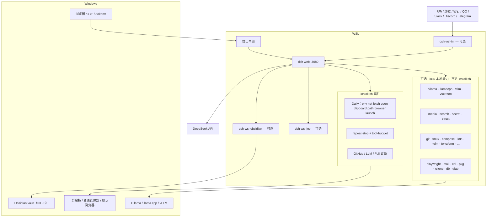

# dsh-wsl-kit

**一句话：** Agent 在 WSL 里跑 DeepSeek Harness，聊天在 Windows 浏览器——路径、代理、剪贴板、打开文件都要跨系统时，装这个套件。

本仓是**元仓**（文档 + 安装脚本 + [`cordis.patch.yml`](./cordis.patch.yml)），不含插件运行时代码。各子插件仓库首页为 `README.md`（较新的插件默认中文）；英文见 `README.en.md`，旧链接 `README.zh.md` 会跳到首页。

[English → README.md](./README.md)

---

## 这些东西怎么拼在一起

本仓不是运行时。`install.sh` 把 **Daily / GitHub / LLM / Full** 插件装进 dsh 的 `web` profile。聊天在 Windows，agent 和工具在 WSL。另有一批 **Linux/本地能力** 可选仓（推理、检索、媒体、只读 DevOps…）**不进** `install.sh`，用 [`link-linux-plugins.sh`](./scripts/link-linux-plugins.sh) 或按需 `dsh plugin add`。IM / Obsidian / Jev 同样不进 `install.sh`。



| 边界 | 谁负责 |
|------|--------|
| Windows 界面 | 浏览器开 `:3081`，URL 带一次性 `?token=`（裸 `:3081` 是 401；`:3080` 只给 WSL） |
| Agent | WSL 里的 `dsh web`，工具走插件 `ctx` |
| 跨系统 Daily | `path` / `open` / `clipboard` / `browser` / `launch` / `net` / `fetch`（`KIT_SET=daily`） |
| Linux 本地可选 | 推理、媒体、沙箱检索、密钥、只读 DevOps 等 — 见 [`docs/OPTIONAL_PLUGINS.zh.md`](./docs/OPTIONAL_PLUGINS.zh.md)；`bash scripts/link-linux-plugins.sh` |
| IM | `dsh-wsl-im` 出站 WS/Stream/Gateway → `ctx.agents`。每个 IM 一个工作区，每个聊天一条会话 |
| Obsidian | `dsh-wsl-obsidian`：WSL agent ↔ Windows NTFS vault + `obsidian://` |
| Jev | `dsh-wsl-jev`：System One（`jev_ask` / `check` / `rank`），OpenRouter 或 TypeSafe |

## 插件版本

下面是 **2026-09-18** 本机兄弟仓的 `package.json`。[`scripts/check-plugin-versions.sh`](./scripts/check-plugin-versions.sh) 里的地板是下限，不是这份快照。

当天本机 dsh 是 **`0.1.7-alpha.2`**（npm `@alpha`，2026-09-24）。npm `latest` 标签可能滞后。脚本仍按 dsh **≥0.1.2** 编写。

### 日常

| 插件 | 版本 | 档位 |
|------|------|------|
| [dsh-wsl-env](https://github.com/173787247/dsh-wsl-env) | 0.3.0 | daily |
| [dsh-wsl-net](https://github.com/173787247/dsh-wsl-net) | 0.5.2 | daily |
| [dsh-wsl-fetch](https://github.com/173787247/dsh-wsl-fetch) | 0.1.2 | daily |
| [dsh-wsl-open](https://github.com/173787247/dsh-wsl-open) | 0.2.0 | daily |
| [dsh-repeat-stop](https://github.com/173787247/dsh-repeat-stop) | 0.1.2 | daily |
| [dsh-tool-budget](https://github.com/173787247/dsh-tool-budget) | 0.1.2 | daily |
| [dsh-wsl-clipboard](https://github.com/173787247/dsh-wsl-clipboard) | 0.1.0 | daily |
| [dsh-wsl-path](https://github.com/173787247/dsh-wsl-path) | 0.2.0 | daily |
| [dsh-wsl-browser](https://github.com/173787247/dsh-wsl-browser) | 0.1.0 | daily |
| [dsh-wsl-launch](https://github.com/173787247/dsh-wsl-launch) | 0.1.0 | daily |

### GitHub 附加与可选

| 插件 | 版本 | 档位 |
|------|------|------|
| [dsh-wsl-github](https://github.com/173787247/dsh-wsl-github) | 0.2.0 | github |
| [dsh-wsl-cred](https://github.com/173787247/dsh-wsl-cred) | 0.2.0 | github |
| [dsh-wsl-notify](https://github.com/173787247/dsh-wsl-notify) | 0.1.0 | github |
| [dsh-wsl-im](https://github.com/173787247/dsh-wsl-im) | 0.3.2 | 不在 `install.sh` |
| [dsh-wsl-obscura](https://github.com/173787247/dsh-wsl-obscura) | 0.1.0 | 不在日常套件 |
| [dsh-wsl-obsidian](https://github.com/173787247/dsh-wsl-obsidian) | 0.1.0 | 不在 `install.sh`（可选） |
| [dsh-wsl-jev](https://github.com/173787247/dsh-wsl-jev) | 0.1.0 | 不在 `install.sh`（可选） |
| [dsh-wsl-ollama](https://github.com/173787247/dsh-wsl-ollama) | 0.1.0 | 不在 `install.sh`（可选） |
| [dsh-wsl-media](https://github.com/173787247/dsh-wsl-media) | 0.2.0 | 不在 `install.sh`（可选） |
| [dsh-wsl-search](https://github.com/173787247/dsh-wsl-search) | 0.2.0 | 不在 `install.sh`（可选） |
| [dsh-wsl-vecmem](https://github.com/173787247/dsh-wsl-vecmem) | 0.1.0 | 不在 `install.sh`（可选） |
| [dsh-wsl-k8s](https://github.com/173787247/dsh-wsl-k8s) | 0.1.0 | 不在 `install.sh`（可选） |
| [dsh-wsl-secret](https://github.com/173787247/dsh-wsl-secret) | 0.2.0 | 不在 `install.sh`（可选） |
| [dsh-wsl-llamacpp](https://github.com/173787247/dsh-wsl-llamacpp) | 0.1.0 | 不在 `install.sh`（可选） |
| [dsh-wsl-vllm](https://github.com/173787247/dsh-wsl-vllm) | 0.1.0 | 不在 `install.sh`（可选） |
| [dsh-wsl-struct](https://github.com/173787247/dsh-wsl-struct) | 0.1.0 | 不在 `install.sh`（可选） |
| [dsh-wsl-git](https://github.com/173787247/dsh-wsl-git) | 0.1.0 | 不在 `install.sh`（可选） |
| [dsh-wsl-tmux](https://github.com/173787247/dsh-wsl-tmux) | 0.1.0 | 不在 `install.sh`（可选） |
| [dsh-wsl-compose](https://github.com/173787247/dsh-wsl-compose) | 0.1.0 | 不在 `install.sh`（可选） |
| [dsh-wsl-systemd](https://github.com/173787247/dsh-wsl-systemd) | 0.1.0 | 不在 `install.sh`（可选） |
| [dsh-wsl-helm](https://github.com/173787247/dsh-wsl-helm) | 0.1.0 | 不在 `install.sh`（可选） |
| [dsh-wsl-terraform](https://github.com/173787247/dsh-wsl-terraform) | 0.1.0 | 不在 `install.sh`（可选） |
| [dsh-wsl-rclone](https://github.com/173787247/dsh-wsl-rclone) | 0.1.0 | 不在 `install.sh`（可选） |
| [dsh-wsl-db](https://github.com/173787247/dsh-wsl-db) | 0.1.0 | 不在 `install.sh`（可选） |
| [dsh-wsl-glab](https://github.com/173787247/dsh-wsl-glab) | 0.1.0 | 不在 `install.sh`（可选） |
| [dsh-wsl-playwright](https://github.com/173787247/dsh-wsl-playwright) | 0.1.0 | 不在 `install.sh`（可选） |
| [dsh-wsl-mail](https://github.com/173787247/dsh-wsl-mail) | 0.1.0 | 不在 `install.sh`（可选） |
| [dsh-wsl-cal](https://github.com/173787247/dsh-wsl-cal) | 0.1.0 | 不在 `install.sh`（可选） |
| [dsh-wsl-pkg](https://github.com/173787247/dsh-wsl-pkg) | 0.1.0 | 不在 `install.sh`（可选） |

### 完整套件其余插件

| 插件 | 版本 | 插件 | 版本 |
|------|------|------|------|
| [gpu](https://github.com/173787247/dsh-wsl-gpu) | 0.2.2 | [port](https://github.com/173787247/dsh-wsl-port) | 0.2.2 |
| [distro](https://github.com/173787247/dsh-wsl-distro) | 0.2.0 | [workspace](https://github.com/173787247/dsh-wsl-workspace) | 0.2.0 |
| [picker](https://github.com/173787247/dsh-wsl-picker) | 0.1.0 | [tray](https://github.com/173787247/dsh-wsl-tray) | 0.2.4 |
| [expose](https://github.com/173787247/dsh-wsl-expose) | 0.2.2 | [hostsvc](https://github.com/173787247/dsh-wsl-hostsvc) | 0.4.3 |
| [clock](https://github.com/173787247/dsh-wsl-clock) | 0.2.0 | [dns](https://github.com/173787247/dsh-wsl-dns) | 0.2.0 |
| [mnt](https://github.com/173787247/dsh-wsl-mnt) | 0.2.0 | [editor](https://github.com/173787247/dsh-wsl-editor) | 0.1.0 |
| [shot](https://github.com/173787247/dsh-wsl-shot) | 0.1.0 | [docker](https://github.com/173787247/dsh-wsl-docker) | 0.2.2 |
| [ssh-agent](https://github.com/173787247/dsh-wsl-ssh-agent) | 0.2.0 | [encoding](https://github.com/173787247/dsh-wsl-encoding) | 0.2.0 |
| [wslconfig](https://github.com/173787247/dsh-wsl-wslconfig) | 0.2.0 | [download](https://github.com/173787247/dsh-wsl-download) | 0.2.0 |

共用库 [dsh-wsl-common](https://github.com/173787247/dsh-wsl-common) `0.1.0` 不是 `KIT_SET` 的一项。

---

## 兼容性（2026-09）

| 项 | 现状 |
|----|------|
| **dsh** | 本机 **`0.1.7-alpha.2`**（npm `@alpha`，2026-09-24）。npm `latest` 可能滞后；要新线用 `@next` / `@alpha`。脚本按 dsh **≥0.1.2** 的 UI 一次性 `?token=`（`:3081`）编写。 |
| **DeepSeek V4.1 Flash** | 官方 API 模型 id 为 **`deepseek-flash`**。旧名 `deepseek-v4-flash` / `deepseek-v4-flash-vision-exp` 暂时会路由到 V4.1 Flash。**本 kit 不写死模型**——在 `~/.dsh/settings.yaml` 的 `llm-deepseek` / 默认模型里改。 |
| **Agent Teams** | 可选实验包（`@deepseek-ai/dsh-experimental-agent-team-profile`，与 dsh 同版本线）。**不在** `install.sh` 里。开了 Teams 会出现更长的 “Deep diving”；测模型请先用普通新会话。 |
| **插件** | 快照见上文 [插件版本](#插件版本)（2026-09-16 兄弟仓）。地板见 [`scripts/check-plugin-versions.sh`](./scripts/check-plugin-versions.sh)。日常套件含 [dsh-wsl-fetch](https://github.com/173787247/dsh-wsl-fetch) **≥0.1.1**。 |

### 子插件 README 约定

- **本兼容表是套件矩阵唯一真源。** 各子插件 README（中英）都有对应的 **兼容性** 表：最低 dsh **≥0.1.2**、链回此处看**最新验证**、套件档位，并说明云端 Flash / Agent Teams 不归 WSL 插件管。
- 每当 dsh 发新线（如 `0.1.5` 正式版或 `0.1.6`），**先改本 kit 表**，再刷新各插件「当前 …」行（或跑文档同步）。没有冒烟通过就不要虚构「已验证」日期。
- API 敏感插件（`net` / `fetch` / `port` / `expose` / `tray` / `hostsvc`）另有 **范围** 段；薄 Daily 工具只保留共用表即可。

仅换到 V4.1 Flash **不必**改 kit 安装逻辑；若默认模型仍是已退役 id，改 settings 即可。

---

## 60 秒上手（推荐：日常套件）

**前提：** WSL 里已能运行 `dsh`（通常 profile = `web`）。建议 `0.1.7-alpha.2`（`@alpha`）或同系列更新。

```sh
curl -fsSL https://raw.githubusercontent.com/173787247/dsh-wsl-kit/master/install.sh \
  | KIT_SET=daily bash
```

然后：

1. 用 [`scripts/restart-dsh-web.sh`](./scripts/restart-dsh-web.sh) 重启（`:3080` dsh + `:3081` Windows 中继）
2. Windows 浏览器打开 **`restart-dsh-web.sh` 打印的 URL**（dsh ≥0.1.2 带 `?token=`；裸 `:3081` 是 401。不要用 `:3080`）。Token 也写在 WSL `/tmp/dsh-ui-url`。
3. 开一个**新会话**（旧会话仍是旧工具集）
4. 可选：把 [`cordis.patch.yml`](./cordis.patch.yml) 合并进 profile（后写的插件 `config` 会**整段替换**，键要写全）

| 想装什么 | 命令 |
|----------|------|
| **日常（默认推荐）** | `KIT_SET=daily bash install.sh` |
| 日常 + GitHub App / 凭据 | `KIT_SET=github bash install.sh` |
| **本地 LLM + 网络诊断** | `KIT_SET=llm bash install.sh` |
| 全家桶 | `KIT_SET=full bash install.sh`（或不设 `KIT_SET`，兼容旧行为） |

本地克隆后：`KIT_SET=daily bash install.sh`

### `restart-dsh-web.sh` 会加载什么

- `NODE_USE_ENV_PROXY=1`，`OLLAMA_API_KEY` 默认 `ollama`
- `NO_PROXY` **仅** `127.0.0.1,localhost`（不要继承 Clash 的 RFC1918 `NO_PROXY` 通配，否则 Node 绕过代理，访问 `api.deepseek.com` 会 TRANSPORT 超时）
- GitHub App：启动前自行 `source "$HOME/.dsh/dsh-wsl-github.env"`

---

## 你马上能用的能力

| 痛点 | 工具 | 插件 |
|------|------|------|
| 代理 / Node 24 打不通 DeepSeek 或 npm | `net_doctor` | [dsh-wsl-net](https://github.com/173787247/dsh-wsl-net) |
| `web_fetch` 报 `TypeError: fetch failed`（API 却通） | 装 [dsh-wsl-fetch](https://github.com/173787247/dsh-wsl-fetch) ≥0.1.1 + `restart-dsh-web.sh` | [dsh-wsl-fetch](https://github.com/173787247/dsh-wsl-fetch) |
| 聊天里的 Linux 路径要在 Windows 打开 | （可点击路径） | [dsh-wsl-open](https://github.com/173787247/dsh-wsl-open) |
| 路径互转、`/mnt/c` 慢 | `path_convert` | [dsh-wsl-path](https://github.com/173787247/dsh-wsl-path) |
| 读写 Windows 剪贴板 | `wsl_clipboard` | [dsh-wsl-clipboard](https://github.com/173787247/dsh-wsl-clipboard) |
| 在 Windows 浏览器打开 PR / 文档链接 | `win_open_url` | [dsh-wsl-browser](https://github.com/173787247/dsh-wsl-browser) |
| Agent 不知道自己在 WSL | （注入 system prompt） | [dsh-wsl-env](https://github.com/173787247/dsh-wsl-env) |

**日常套件** = 上表 + `win_launch` + `dsh-repeat-stop` + `dsh-tool-budget` + **`dsh-wsl-fetch`**。

冒烟：对新会话说「跑一下 `net_doctor`」「把当前路径拷到 Windows 剪贴板」。云端优先选 **`deepseek-flash`**；第一次冒烟先关掉 Agent Teams。

---

## 安装组合（短名单）

| 组合 | 包含 | 适合谁 |
|------|------|--------|
| **日常** | env、net、**fetch**、open、repeat-stop、tool-budget、clipboard、path、browser、launch | 绝大多数 WSL + Windows 浏览器用户 |
| **GitHub 日常** | 日常 + [github](https://github.com/173787247/dsh-wsl-github) + [cred](https://github.com/173787247/dsh-wsl-cred) + notify | 还要查 PR/Actions、修 `git push` 凭据 |
| **本地 LLM** | env、net、**fetch**、hostsvc、docker、dns、clock、gpu、port、expose、tray、open、path、browser | Ollama / vLLM / Unsloth + 连通性 |
| **完整** | [`install.sh`](./install.sh) 全部 | 诊断 GPU/Docker/时钟、托盘启动、portproxy 等 |

**不要**一上来装完整套——先日常跑通，再按痛点加插件。

### GitHub 日常（可选）

WSL 里碰 GitHub = 凭据 + API + 浏览器打开 + 代理，不是一个大插件能糊弄的。装 `KIT_SET=github` 后：

1. 按 [dsh-wsl-github](https://github.com/173787247/dsh-wsl-github/blob/master/README.zh.md) 创建 GitHub App（只读 Metadata / PR / Actions，关 webhook）
2. 启动前：`source "$HOME/.dsh/dsh-wsl-github.env"`
3. 新会话里跑 `github_app_hint` / `github_repo_status`；**不要**把 PEM / PAT 贴进聊天

---

## Node 24 + Windows 代理

Clash / V2Ray 在 Windows、WSL 要走代理时：

```sh
export HTTP_PROXY=http://127.0.0.1:7890   # 或 Clash mixed，如 16006
export HTTPS_PROXY=http://127.0.0.1:7890
export NODE_USE_ENV_PROXY=1
# 推荐用 restart-dsh-web.sh，保证 NO_PROXY 只有回环
```

仍不通 → 让 Agent 跑 `net_doctor`。

- **API 通、`web_fetch` 失败** → [dsh-wsl-fetch](https://github.com/173787247/dsh-wsl-fetch)（日常套件已装）。
- **第三方 Workers / Cloudflare 经 Clash 返回 403（1010）** → 对该域名加 Clash **DIRECT**（插件改不了站点 WAF）。

本地 Ollama / LM Studio 等在 Windows 上：加 [dsh-wsl-hostsvc](https://github.com/173787247/dsh-wsl-hostsvc)，跑 `host_reach`，再合并 [`examples/local-llm-providers.settings.yaml`](./examples/local-llm-providers.settings.yaml)。

---

## 故障树

连不上 Ollama、API、git push、`web_fetch` 时先看 **[docs/TROUBLESHOOTING.zh.md](./docs/TROUBLESHOOTING.zh.md)**（英文：[TROUBLESHOOTING.md](./docs/TROUBLESHOOTING.md)）。

推荐顺序：`host_reach` → `net_doctor` → `dns_doctor` → `clock_doctor` → workspace/mnt → expose（仅 LAN）。

---

## 完整插件目录（按需查阅）

<details>
<summary>点击展开全部插件表</summary>

### 日常（KIT_SET=daily）

| 插件 | 作用 |
|------|------|
| [dsh-wsl-env](https://github.com/173787247/dsh-wsl-env) | 向 system prompt 注入 WSL/Windows 事实 |
| [dsh-wsl-net](https://github.com/173787247/dsh-wsl-net) | `net_doctor` |
| [dsh-wsl-fetch](https://github.com/173787247/dsh-wsl-fetch) | 让 `web_fetch` 走 Windows 代理（undici `ProxyAgent`） |
| [dsh-wsl-open](https://github.com/173787247/dsh-wsl-open) | 聊天路径在 Windows 打开 |
| [dsh-repeat-stop](https://github.com/173787247/dsh-repeat-stop) | 连续相同工具调用硬拦截 |
| [dsh-tool-budget](https://github.com/173787247/dsh-tool-budget) | 会话级工具次数上限 |
| [dsh-wsl-clipboard](https://github.com/173787247/dsh-wsl-clipboard) | `wsl_clipboard` |
| [dsh-wsl-path](https://github.com/173787247/dsh-wsl-path) | `path_convert` |
| [dsh-wsl-browser](https://github.com/173787247/dsh-wsl-browser) | `win_open_url` |
| [dsh-wsl-launch](https://github.com/173787247/dsh-wsl-launch) | `win_launch`（白名单） |

### GitHub 附加

| 插件 | 作用 |
|------|------|
| [dsh-wsl-github](https://github.com/173787247/dsh-wsl-github) | `github_app_hint` / `github_repo_status` |
| [dsh-wsl-cred](https://github.com/173787247/dsh-wsl-cred) | `cred_hint`（不输出密钥） |
| [dsh-wsl-notify](https://github.com/173787247/dsh-wsl-notify) | `win_notify` |

### 诊断 / UI / 二梯队

| 插件 | 作用 |
|------|------|
| [dsh-wsl-gpu](https://github.com/173787247/dsh-wsl-gpu) | `gpu_doctor` |
| [dsh-wsl-port](https://github.com/173787247/dsh-wsl-port) | `port_doctor` |
| [dsh-wsl-distro](https://github.com/173787247/dsh-wsl-distro) | `distro_info` |
| [dsh-wsl-workspace](https://github.com/173787247/dsh-wsl-workspace) | `wsl_workspace` |
| [dsh-wsl-picker](https://github.com/173787247/dsh-wsl-picker) | `wsl_picker` |
| [dsh-wsl-tray](https://github.com/173787247/dsh-wsl-tray) | `wsl_tray` |
| [dsh-wsl-expose](https://github.com/173787247/dsh-wsl-expose) | `wsl_expose` |
| [dsh-wsl-hostsvc](https://github.com/173787247/dsh-wsl-hostsvc) | `host_reach` |
| [dsh-wsl-clock](https://github.com/173787247/dsh-wsl-clock) | `clock_doctor` |
| [dsh-wsl-dns](https://github.com/173787247/dsh-wsl-dns) | `dns_doctor` |
| [dsh-wsl-mnt](https://github.com/173787247/dsh-wsl-mnt) | `mnt_doctor` |
| [dsh-wsl-editor](https://github.com/173787247/dsh-wsl-editor) | `win_editor` |
| [dsh-wsl-shot](https://github.com/173787247/dsh-wsl-shot) | `win_shot` |
| [dsh-wsl-docker](https://github.com/173787247/dsh-wsl-docker) | `docker_doctor` |
| [dsh-wsl-ssh-agent](https://github.com/173787247/dsh-wsl-ssh-agent) | `ssh_agent_hint` |
| [dsh-wsl-encoding](https://github.com/173787247/dsh-wsl-encoding) | `encoding_doctor` |
| [dsh-wsl-wslconfig](https://github.com/173787247/dsh-wsl-wslconfig) | `wslconfig_hint` |
| [dsh-wsl-download](https://github.com/173787247/dsh-wsl-download) | `win_download` |

可选相关：[session-contract](https://github.com/173787247/session-contract)。awesome 片段：[`awesome-wsl-kit.md`](./awesome-wsl-kit.md)。

**Awesome 现状（2026-09-24）：** Daily/工具向约 **35** 条已在 awesome main（含 jev / obsidian）。本批 **22** 个 Linux 可选仓 PR [#5783](https://github.com/awesome-dsh-plugin/awesome-dsh-plugin/pull/5783)–[#5790](https://github.com/awesome-dsh-plugin/awesome-dsh-plugin/pull/5790) 已开且 CI 绿，等合入。进度见 [`docs/AWESOME_QUEUE.zh.md`](./docs/AWESOME_QUEUE.zh.md)。**本 kit 元仓不进 awesome** — 用本仓 / `install.sh` 安装。

</details>

---

## kit 之外怎么长

已经落地的不要再当新方向重开（`fetch` 0.1.2、`obscura`、版本地板、401 健康检查、`hostsvc` `apiReady`、`:3081` token 中继）。只有新产品才开新仓。钉钉没有自己的仓。

**规划（2026-09-24）：** Daily 套件稳住；新产品走 **可选 Linux/本地能力** 开仓（中文首页 + `README.en.md`，默认只读/双重确认）。完整目录与批量链接 → [`docs/OPTIONAL_PLUGINS.zh.md`](./docs/OPTIONAL_PLUGINS.zh.md) · `bash scripts/link-linux-plugins.sh`。awesome 队列 → [`docs/AWESOME_QUEUE.zh.md`](./docs/AWESOME_QUEUE.zh.md)。

| 方向 | 规划 | 现状 |
|------|------|------|
| 飞书 / 企微 / 钉钉 / QQ / Slack / Discord / Telegram | 继续深挖 [dsh-wsl-im](https://github.com/173787247/dsh-wsl-im)，**不进** `install.sh`。 | **0.3.2**；awesome [#5222](https://github.com/awesome-dsh-plugin/awesome-dsh-plugin/pull/5222) |
| Obsidian / Jev | [obsidian](https://github.com/173787247/dsh-wsl-obsidian) · [jev](https://github.com/173787247/dsh-wsl-jev)；**不进** `install.sh`。 | 已在 awesome main |
| 本地推理 | ollama · llamacpp · vllm · vecmem | 仓已开；目录见 OPTIONAL_PLUGINS；awesome B/C 等合 |
| 媒体 / 检索 / 密钥 / 结构 | media · search · secret · struct | 同上 |
| 只读 DevOps | git · tmux · compose · systemd · k8s · helm · terraform · rclone · db · glab | 同上（E–G） |
| 桌面辅助 | playwright · mail · cal · pkg | 同上（H–I） |
| MCP / OpenClaw / Agent Teams | 上游或独立运行时，不进本 kit | 不进 kit |
| 薄 UX | editor / shot / notify / picker | 暂缓 |

---

## 安全

- 插件与 Harness 同权（读文件、联网、经 PowerShell 调 Windows）。
- `win_launch` 有白名单；`cred_hint` / GitHub App **不**把密钥贴进对话。
- `win_notify` 会阻塞弹窗，文案勿含密钥。
- `~/.dsh/*.env` 保持 `chmod 600`，勿把 API Key 提交进仓库。

## Topics

`deepseek-harness` · `dsh-plugin` · `wsl` · `windows` · `github-app`

## 许可

MIT（与各子插件相同）。
