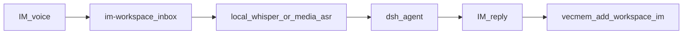

# 推荐调用链（DSH 可选插件）

对照加深队列：[`ENHANCEMENT_QUEUE.zh.md`](./ENHANCEMENT_QUEUE.zh.md)。

## IM 语音 → ASR → 短记忆

1. 用户在企微/QQ/飞书等发语音 → `dsh-wsl-im` 落盘到 `~/.dsh/im-workspace/<platform>/inbox`。
2. 平台 ASR 为空时，IM 0.3.6+ 尝试本机 `whisper`（`DSH_IM_VOICE_ASR`）；也可手动 `media_asr`（`dsh-wsl-media`，allowRoots 已含 im-workspace）。
3. Agent 回复后，可选 `agent.vecmemOnReply` 或手动 `vecmem_add`，`workspace=im:qq`（等）。

## 剪贴板对称（Win / Mac）

| 端 | 插件 | 工具 |
|----|------|------|
| Windows（WSL） | `dsh-wsl-clipboard` | 读/写 Windows 剪贴板 |
| Windows 截图 | `dsh-wsl-shot` | 剪贴板图 → WSL 文件 |
| macOS | `dsh-mac-companion` | `mac_clipboard_read` / `mac_clipboard_write`（写需 confirm） |

Companion 协议客户端在 `dsh-wsl-common` 的 `companion_client`（mac / device-bridge 共用）。

## 远程只读探针

1. 配置 `dsh-remote-ssh` hosts + allowCommands。
2. `remote_ssh_status` → `remote_ssh_probe`（固定套装）→ 必要时 `remote_ssh_run`。
3. 实验室：`examples/ssh-lab` + `dsh-wsl-ssh-agent`。

## 搜索范围

`dsh-wsl-search` 默认根含 `$HOME`、`~/.dsh`、`~/.dsh/im-workspace`，避免无目标扫 `/mnt/c`。

## 出站纯文本

`dsh-wsl-im` 的 `im-plain` 作用于 QQ / 钉钉 / Telegram / Mattermost。飞书与企微客户端 Markdown 尚可，**暂不**强制展平（实测差再改）。
